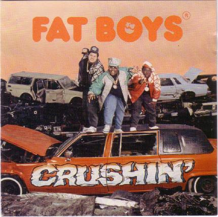

= Hip-Hop and Me
:showtitle:
:page-navtitle: Hip-Hop and Me
:page-excerpt: I was reading an article about Ice-T doing the Grammy show and how far rap has come over the last 50 years. I agree and it made me consider my own memories.
:page-root: ../../../

I was reading an article about Ice-T doing the Grammy show and how far rap has come over the last 50 years. I agree and it made me consider my own memories.

I remember the first hip-hop song that got me hooked on the genre – Wipe Out by the Fat Boys. I have always loved The Beach Boys, so the mashup was awesome but strange. I think even then though, I was aware The Safaris originally sang wipeout and I was initially confused by the collaboration.

The thing is, while there are better earlier hip hop/rap songs – beyond the rare appearance of The Sugarhill Gang’s Rappers Delight – rarely was rap played on any stations my parents listened to. That meant my exposure was very low, but this crossed over to being played everywhere because of The Beach Boys’ connection.

I attended a birthday party where it was played over and over – and I wanted it for myself. I had my birthday money and really wanted the cassette. My father, who only had exposure to the band through this one song, stated the music wasn’t for me and wasn’t going to allow it. My mother on the hand stood up and said it was my money and I should be able to buy what I wanted. In the end, my mother won the argument.

I was taken to Hill’s in Amherst and purchased the cassette. When we arrived home, I went straight to my room and started listening to the cassette. I loved the whole thing, but the language and themes in the rest of the songs meant that I knew I wouldn’t be able to listen anywhere in earshot of my parents. This broke me because I loved it. I just didn’t want it ripped from me.

I ended up doing the logical thing and told my parents I didn’t like the album. Even though I had and would continue to buy albums just for a single song – I asked if we could return it. I was 11 and this was 15.00 (50.00ish today with inflation). My father took me back to Hill’s and handled the return (he gave the I told you so speech on the drive). Dejected I spent the return money on a lego set I believed.

This is a landmark moment in many ways. Not just because of what the music was, but, because I had purchased music instead of a toy. It was that cusp of growing up, and I went back to being a kid (which could be why I still buy toys today). It also dealt with awareness of perception. If my parents had heard the music I was listening to, the next thing they would have done was paid attention to the books I was reading. It was all self-preservation. It was also the only time I ever returned music for a refund.

Time would continue t march on. The genie didn’t go back into the bottle. I still loved the music. I could point out songs here or there – but it wasn’t until my sophomore year that I made it past things on the level of MC Hammer and Vanilla Ice. Let’s be honest though, parents wouldn’t have been a fan of every song on To The Extreme – which would be my first majorly played and owned hip hop album.

I joined the marching band. For every away game and band festival my friend Jeremy brought along his boombox. There was quite a bit of harder (non-parent approved) rock played – but in the regular rotation were Beastie Boys and NWA. I was back to being fully in and most of the cassettes I would purchase for the rest of high school would be hip hop and rap.

Even then in my town, with my friends, I was an outlier overall. Most didn’t enjoy the genre unless it was a top-ten hit. Others had stricter parents paying attention to their music – so didn’t own the albums. They mostly stayed with rock. I would like to say that after graduation I purchased my first CD – Tag Team, Whoomp There it is. It was 30.00 in 1994 at Fisher Big Wheel. Also, not a great or deep album – but for the second time in my life – the first time I purchased music in a new format for myself and once again the same genre.

Outside of all of that though – even as a preteen – I was confused about why rap was nominated for Grammy’s or on the Billboard charts in the R&B category. MTV awards acknowledged the genre was distinct and separate, but everywhere else just lumped all black music into R&B. today though that has all changed.

Growing up rock was the dominant genre of music. Then we had the dark ages for years where country became dominant (thank god that is over). Then for the last decade rap/hip hop became the dominant genre – with rock selling so low they dropped the TV time for most rock awards from the Grammy’s last year. The genre is getting its proper recognition and place finally.

Between friends stating it sucked or my father stating “it wasn’t music for me” – it seems, with time, both were wrong. People can still dislike it – I suffered through farm emo being the dominant musical genre – I can’t say it sucked – it just wasn’t for me.

Congratulations to hip hop/rap for its life and evolution over 50 years. I’m glad that I was there for most of it.